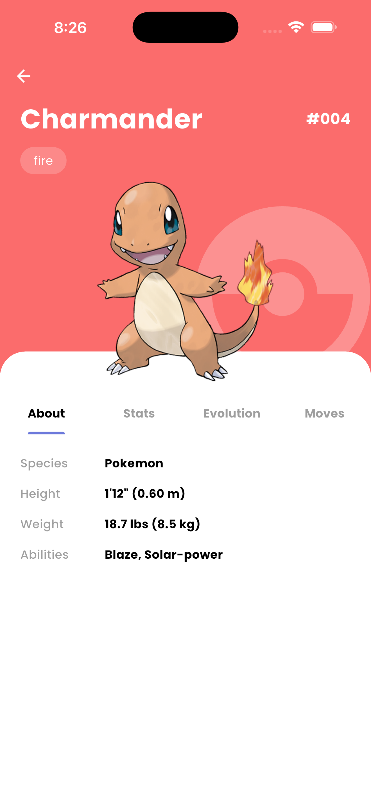
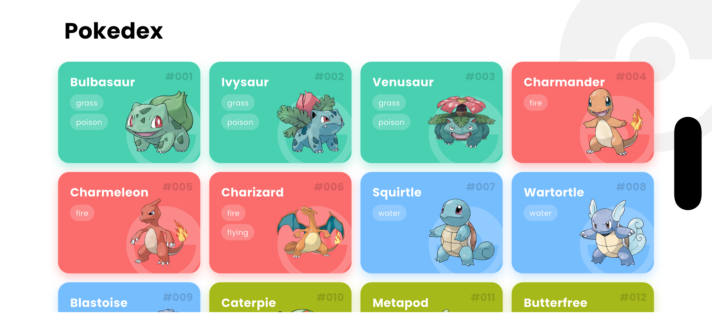

# Pokedex App 📱

A modern, responsive Pokedex application built with Flutter, demonstrating **Repository Pattern** and **Riverpod** state management.

## ✨ Features

* **Infinite Scrolling:** Pagination support for browsing thousands of Pokemon seamlessly.
* **Responsive Design:** Optimized layout for both Portrait and Landscape modes (Mobile & Tablet).
* **Detailed Statistics:** View Base Stats, Evolutions, and Moves with smooth animations.
* **Beautiful UI:** Custom hero transitions, shimmer loading effects, and dynamic coloring based on Pokemon types.
* **Scalable Architecture:** Built using MVVM + Repository Pattern for maintainability.

## 🛠 Tech Stack

* **Framework:** Flutter (3.10+)
* **State Management:** Riverpod (ConsumerWidget & StateNotifier)
* **Network:** Dio
* **Routing:** GoRouter
* **Architecture:** MVVM with Repository Pattern
* **Testing:** Flutter Test & Mocktail
* **UI Components:** Google Fonts, Shimmer, CachedNetworkImage

## 📸 Screenshots

| Home (Portrait) | Detail (Portrait) | Landscape Mode |
|:---:|:---:|:---:|
|  |  |  |

## 🚀 How to Run

1.  Clone the repository
2.  Run `flutter pub get`
3.  Run `dart run flutter_launcher_icons` (optional: to generate icons)
4.  Run `flutter run`
5.  Run `flutter test` (Optional: to execute unit tests)

## 📂 Project Structure

```text
lib/
├── core/
│   ├── constants/      # App colors & configuration
│   └── router/         # Navigation routing (GoRouter)
├── data/
│   ├── models/         # Data models (JSON serialization)
│   └── repositories/   # Data fetching logic & API calls
├── presentation/
│   ├── providers/      # Riverpod state management
│   ├── screens/        # Main application screens
│   └── widgets/
│       ├── common/     # Reusable widgets (PokemonCard, Shimmer)
│       └── detail/     # Detail page specific widgets (Tabs)
└── main.dart           # Application entry point